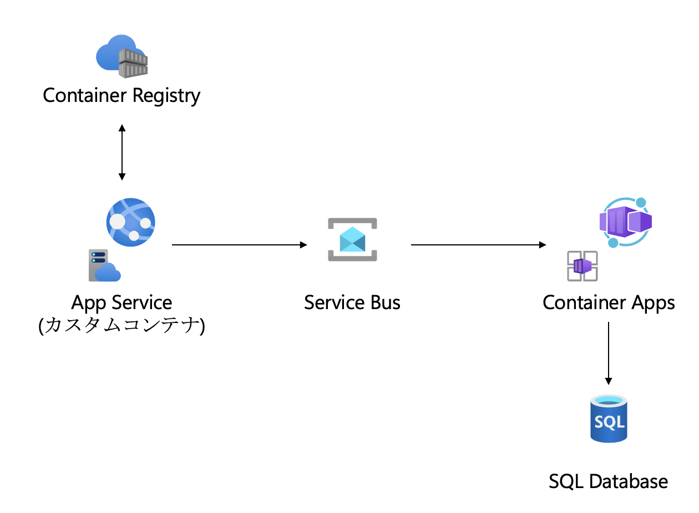

## Azure 上でコンテナを活用して Tomcat を構築

このプロジェクトでは、コンテナを使用して Tomcat を構築します。

以下のアーキテクチャ図は、プロジェクトの概要を示しています。



## リソース概要

以下のリソースがハンズオンを通じてデプロイされます：

- **リソースグループ**: アプリケーションのリソースを管理するためのコンテナ。
- **App Service Plan**: Web アプリや API アプリをホストするための環境。
- **Container Registry**: Docker コンテナイメージを格納するためのプライベートレジストリ。
- **ストレージアカウント**: バッチ処理の対象となるファイルサーバ

## 前提準備

プロジェクトを開始する前に、以下のツールがインストールされていることを確認してください。

- [Git](https://git-scm.com/book/ja/v2/%E4%BD%BF%E3%81%84%E5%A7%8B%E3%82%81%E3%82%8B-Git%E3%81%AE%E3%82%A4%E3%83%B3%E3%82%B9%E3%83%88%E3%83%BC%E3%83%AB) - 本ハンズオンをクローンするために必要です。
- [Azure Developer CLI](https://learn.microsoft.com/ja-jp/azure/developer/azure-developer-cli/install-azd?tabs=winget-windows%2Cbrew-mac%2Cscript-linux&pivots=os-mac) - Azure リソースを管理するために必要です。

## セットアップ手順

プロジェクトをローカル環境で実行するための手順は以下の通りです。

1. リポジトリをクローンします。

    ```bash
    git clone https://github.com/kohei3110/tomcat-messaging-on-azure.git
    cd tomcat-messaging-on-azure
    ```

2. Azure Developer CLI を使用してプロジェクトをデプロイします。

    ```bash
    azd up
    ```

3. アプリケーションにアクセスします。

    ```
    https://<app_service_name>.azurewebsites.net/myapp/hello
    ```

    **Hello, Struts1!** と表示されれば成功です。

4. WebJobs を作成します。

    `azd up` コマンドにより生成された `./app/2.scheduled-tasks/archive.zip` を WebJobs にアップロードします。
