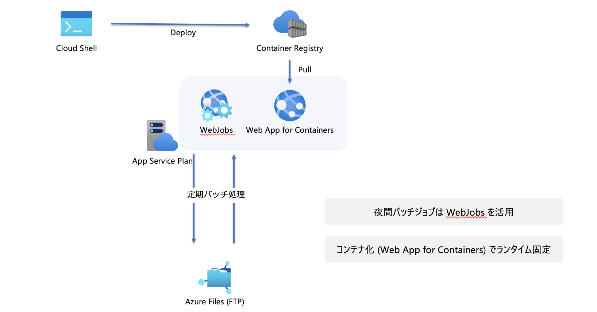

## Tomcat 上でメッセージングサービスを構築

このプロジェクトでは、Tomcat サーバーを使用してメッセージングサービスを構築します。

以下のアーキテクチャ図は、プロジェクトの概要を示しています。



## リソース概要

以下のリソースがハンズオンを通じてデプロイされます：

- **リソースグループ**: アプリケーションのリソースを管理するためのコンテナ。
- **App Service Plan**: Web アプリや API アプリをホストするための環境。
- **Container Registry**: Docker コンテナイメージを格納するためのプライベートレジストリ。
- **Service Bus**: メッセージングと統合サービス。
- **Container Apps**: コンテナ化されたアプリケーションを実行するためのサービス。
- **SQL Database**: リレーショナルデータベースサービス。

## 前提準備

プロジェクトを開始する前に、以下のツールがインストールされていることを確認してください。

- [Azure Developer CLI](https://learn.microsoft.com/ja-jp/azure/developer/azure-developer-cli/install-azd?tabs=winget-windows%2Cbrew-mac%2Cscript-linux&pivots=os-mac) - Azure リソースを管理するために必要です。

## セットアップ手順

プロジェクトをローカル環境で実行するための手順は以下の通りです。

1. リポジトリをクローンします。

    ```bash
    git clone https://github.com/kohei3110/tomcat-messaging-on-azure.git
    cd tomcat-messaging-on-azure
    ```

2. Azure Developer CLI を使用してプロジェクトをデプロイします。

    ```bash
    azd up
    ```

3. サービスプリンシパルを作成し、権限を割り当てます。

## 既知の問題

- マルチステージビルドによるコンテナのスリム化

- Publisher アプリケーションビルド時のエラー（動作には影響なし）

```
org.apache.tomcat.util.bcel.classfile.ClassFormatException: Invalid byte tag in constant pool: 19
	at org.apache.tomcat.util.bcel.classfile.Constant.readConstant(Constant.java:133)
	at org.apache.tomcat.util.bcel.classfile.ConstantPool.<init>(ConstantPool.java:60)
	at org.apache.tomcat.util.bcel.classfile.ClassParser.readConstantPool(ClassParser.java:209)
```

- SQL Database への接続設定

    - 「Azure サービスおよびリソースにこのサーバーへのアクセスを許可する」をセット

- Service Bus への権限設定

    - サービスプリンシパルの権限「Azure Service Bus のデータ所有者」を手動でセット